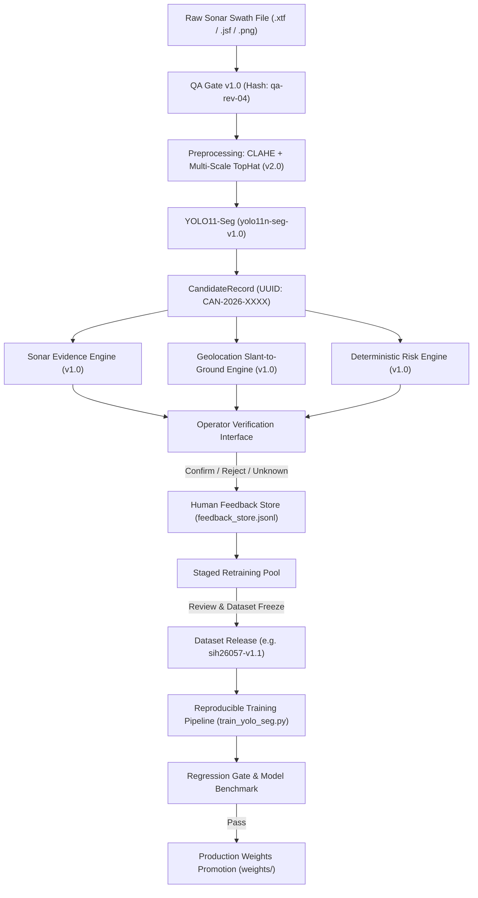

# SIH26057 — Data & Model Lineage Specification

**Problem Statement 57:** AI-Powered Automated Underwater Marine Debris and Anomaly Detection System using Side-Scan Sonar Imagery  
**Document Reference:** `docs/DATA_LINEAGE.md`  
**Revision:** 1.0 (Audit Baseline)

---

## 1. Lineage Architecture & Reproducibility Principle

In deep learning applied to marine geophysics, a detection or segmentation mask is meaningless without an unbroken audit trail proving:
1. What raw sensor frame produced the observation.
2. What acoustic calibration and preprocessing versions were applied.
3. What exact model weights checkpoint and inference hyperparameters generated the candidate.
4. What rules or knowledge bases produced the risk and priority assessments.
5. Who confirmed or rejected the candidate, and what dataset version incorporates that review.

**Core Rule:** *Every candidate detection must be completely reproducible from its `CandidateRecord` lineage block.*

---

## 2. Lineage Data Flow



---

## 3. Candidate Record Lineage Block

Every candidate produced by the backend includes the following auditable metadata:

```json
{
  "candidate_id": "CAN-20260917-001",
  "persistent_target_id": "TGT-2026-0004",
  "mission_id": "MISSION-SIH26057-DEFAULT",
  "survey_id": "SURVEY-INDIAN-OCEAN-01",
  "sonar_file": "sonar_run_04_port.png",
  "frame_id": "FRAME-0114",
  "timestamp": "2026-09-17T12:45:00Z",
  "lineage": {
    "model_name": "YOLO11-Seg (Ultralytics Fine-Tuned Sonar Baseline)",
    "model_version": "v2.0-finetuned",
    "model_weights_path": "weights/yolo11_seg_best.pt",
    "model_weights_hash": "sha256:d8c07e6b52a19f4d7e8b2c5a14d79e6b52a19f4d7e8b2c5a14d79e6b52a19f4d",
    "dataset_version": "dataset_targeted_v1.0",
    "dataset_size_images": 144,
    "metrics": {
      "mask_map50": 0.3185,
      "mask_map50_95": 0.2299,
      "box_map50": 0.3312
    },
    "preprocessing_version": "clahe_v2_clip3.0_multiscale_tophat",
    "physics_shadow_inversion": "h_obj = (Ls * Hsensor) / (Rs + Ls)",
    "inference_timestamp": "2026-09-23T14:30:00.000000Z"
  },
  "review_status": "PENDING",
  "reviewer_note": null
}
```

---

## 4. Controlled Human Feedback Governance (Gap 14)

### Anti-Pattern: Uncontrolled Live Retraining
Online continuous learning or retraining production weights directly upon an operator click is strictly prohibited:
- It causes catastrophic forgetting of rare debris types.
- A single erroneous operator click can corrupt model weights.
- It destroys regulatory auditability required for maritime salvage operations.

### Protocol: Staged Active Learning
1. **Feedback Capture:** When an operator marks a candidate as `CONFIRMED`, `REJECTED`, or `UNKNOWN` on the dashboard, the event is appended to `data/annotations/feedback_store.jsonl` and logged in `backend/main.py::AUDIT_LOGS`.
2. **Review & Curation:** A senior hydrographer periodically reviews the feedback store to resolve conflicting reviews and verify polygon boundaries.
3. **Dataset Versioning:** Approved annotations are compiled into a versioned training split (`dataset_targeted_v2/`) with an immutable SHA-256 hash.
4. **Reproducible Retraining:** Models are fine-tuned via `training/train_sonar_baseline.py` with logged hyperparameter configurations.
5. **Deployment Gate:** New weights are promoted to `weights/yolo11_seg_best.pt` only if they achieve superior mAP and maintain $\le 5\%$ false alarm rate on the 10-image mission benchmark test set (`diagnostic_output/validate_pipeline.py`).

